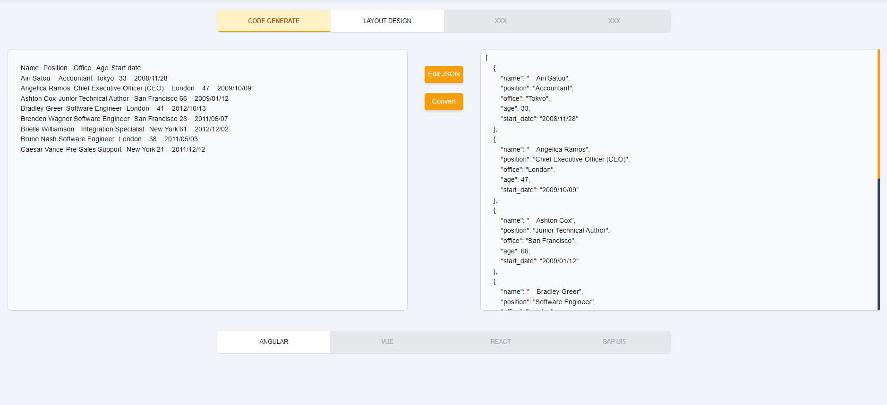

# Templer: The Essential Tool for Front-End Developers

## Introduction
Templer is an online application that I've designed to streamline front-end development by providing efficient, fast, and user-friendly code generation tools. It offers various functionalities such as converting Excel data into JSON, generating HTML tables, and creating boilerplate codes, making it an invaluable asset for front-end developers. Furthermore, it supports numerous frameworks and libraries, thus facilitating the creation of visually appealing and functional websites.

## Goal of the Project
Crafted by a developer for developers, Templer is designed with the explicit aim of accelerating front-end development. My mission extends beyond merely being another tool in a developer's toolkit — I aspire to be the best. My ultimate goal is to establish Templer as an indispensable ally for front-end developers, offering a platform that nurtures creativity and fosters productivity. I invite developers worldwide to join me on this exciting journey and experience the transformative power of Templer. Together, we can shape the future of front-end development.

## Contribute
As a passionate developer, I extend a warm invitation to you to join me in refining and expanding Templer. This project thrives on shared ingenuity, expertise, and dedication. Your contributions — whether they involve implementing new features, squashing bugs, or enhancing documentation — can significantly influence the evolution of this tool, turning it into a transformative asset for front-end developers worldwide. Let's collaborate, learn, and create together. Dive into our code, improve upon our framework, and help us make Templer the go-to resource for developers everywhere. Your journey with Templer starts here – contribute today and let's revolutionize front-end development together!

## Installation
You can get started by downloading or forking the project, running 'npm install', and then 'ng serve'. And voila, you're ready to go!

## Current Features

### JSON Conversion
Templer allows you to convert Excel tables and other web tables into JSON code seamlessly. Simply paste your Excel data, hit the convert button, and receive your JSON code instantly.

### Code Generation
Templer doesn't just convert data; it also generates codes for tables. With Angular options, you can inspect and copy HTML, CSS, and TypeScript code. File downloads are also supported for your convenience.

### User Interface Customization
You can adjust the look and feel of your workspace by selecting from six primary colors and toggling between dark and light themes.

### Angular Material Support
Enhance your coding experience with the Angular material option, which provides additional settings for filtering, sorting, pagination, selection, reordering columns, and more.

### Code Editing
Templer provides an in-built JSON code editor where you can add or remove key-value pairs, and generate data such as Boolean, number, and string. 

## How to Use
The website is divided into two main sections: Excel to JSON conversion and code generation, and a beta layout designer (flexbox and grid). You can use these tools to streamline your front-end development workflow.

## Pictures

